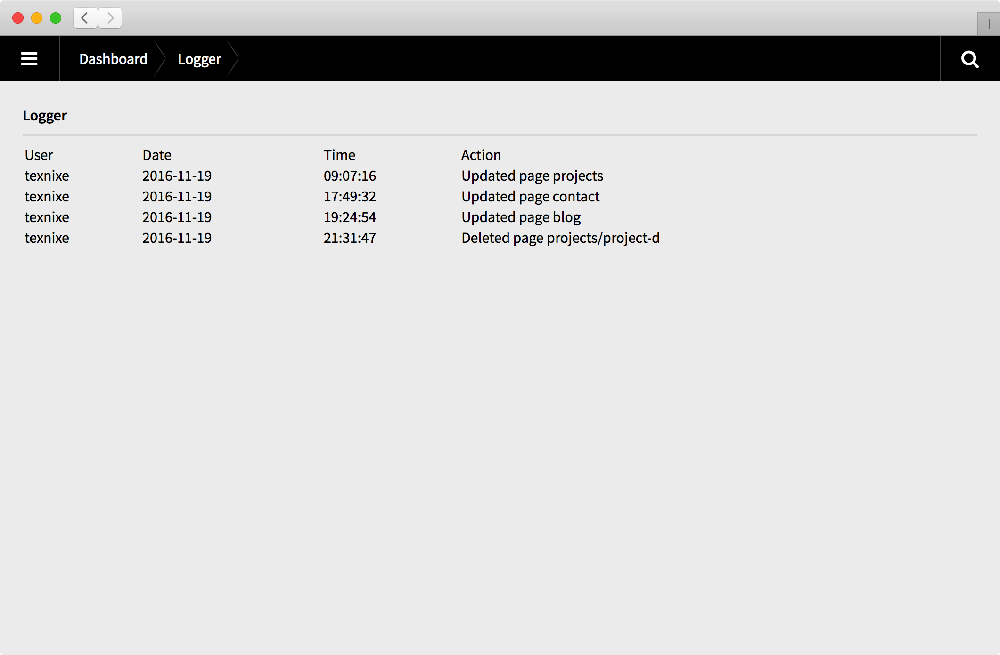

# Kirby Logger

Logger is a [Kirby CMS](https://getkirby.com) plugin that logs all changes to the content folder to a log file. Admins can view all changes in a separate view in the panel, which is accessible via a dashboard widget.

If you don't want to or cannot use Git to track changes to the content folder but want keep an eye on who changed what and when, this plugin might be for you.

**Note:** As of version 1.3.0, the date and time fields were combined. Old log files will therefore not be compatible with the new version.



## Requirements

- PHP 5.6+

## Installation

### Download

[Download the files](https://github.com/texnixe/kirby-logger/archive/master.zip) and place them inside `site/plugins/logger`.

### Kirby CLI
Installing via Kirby's [command line interface](https://github.com/getkirby/cli):

    $ kirby plugin:install texnixe/kirby-logger

To update Logger, run:

    $ kirby plugin:update texnixe/kirby-logger

### Git Submodule
You can add the Logger plugin as a Git submodule.

    $ cd your/project/root
    $ git submodule add https://github.com/texnixe/kirby-logger.git site/plugins/logger
    $ git submodule update --init --recursive
    $ git commit -am "Add Kirby Logger"

Run these commands to update the plugin:

    $ cd your/project/root
    $ git submodule foreach git checkout master
    $ git submodule foreach git pull
    $ git commit -am "Update submodules"
    $ git submodule update --init --recursive

## Options
The following options can be set in your `/site/config/config.php`:

```php
c::set('logger.roles', ['admin']);
c::set('logger.entries', 50);
c::set('logger.language', 'en');
c::set('logger.translation', [
  'site.update'  => 'Changed site options',
  'page.create'  => 'Created page %s',
  'page.update'  => 'Updated page %s',
  'page.delete'  => 'Deleted page %s',
  'page.sort'    => 'Sorted page %s',
  'page.hide'    => 'Hid page %s',
  'page.move'    => 'Moved page %1$s to %2$s',
  'file.upload'  => 'Uploaded file %s',
  'file.replace' => 'Replaced file %s',
  'file.rename'  => 'Renamed file %s',
  'file.update'  => 'Updated file %s',
  'file.sort'    => 'Sorted file %s',
  'file.delete'  => 'Deleted file %s',
  'user'         => 'User',
  'date'         => 'Date',
  'time'         => 'Time',
  'action'       => 'Action'
]);    
```
### logger.roles

An array of roles that are allowed to view the log (and the Panel widget)

### logger.entries

Number of changes to show in the Panel view. Default: 50

### logger.language

Default language for log entries; choose one of the currently four translations provided with the plugin ('en', 'de', 'pt_BR', 'pt_PT').

### logger.translation

An array with custom translations. This will override the default translations set by the `logger.language` option.

## Changelog

### 1.3.1

- Added pagination

### 1.3.0

- Combined date/time field

## Credits

This plugin is inspired by and heavily reuses code of these two great Kirby plugins:

- [Auto Git](https://github.com/pedroborges/kirby-autogit) plugin by @pedroborges
- [Static Translations](https://github.com/rasteiner/kirbytranslations) plugin by @rastainer

## License

Logger is open-sourced software licensed under the MIT license.

Copyright © 2016 Sonja Broda info@texniq.de https://www.texniq.de
